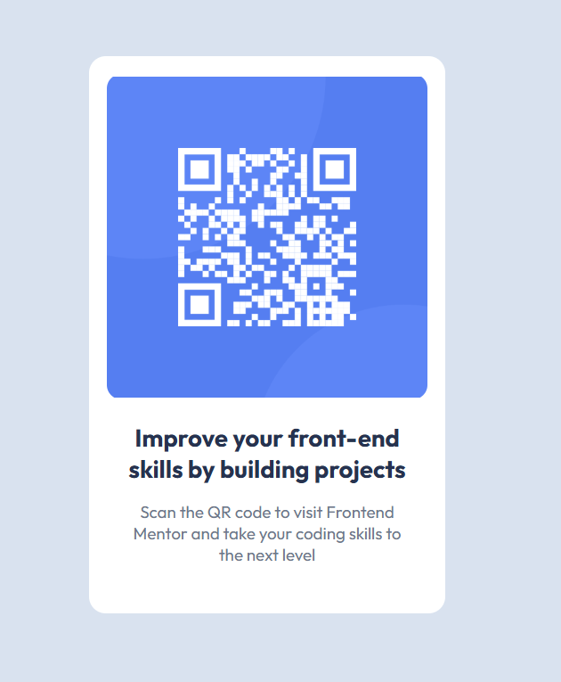

# Frontend Mentor - QR code component solution

This is a solution to the [QR code component challenge on Frontend Mentor](https://www.frontendmentor.io/challenges/qr-code-component-iux_sIO_H). Frontend Mentor challenges help you improve your coding skills by building realistic projects. 

## Table of contents

  - [Overview](#overview)
  - [Screenshot](#screenshot)
  - [Links](#links)
  - [My process](#my-process)
  - [Built with](#built-with)
  - [What I learned](#what-i-learned)
  - [Continued development](#continued-development)
  - [AI Collaboration](#ai-collaboration)
  - [Author](#author)

## Overview

This challenge is a qr component that guides users seeking to develop their front-end skills to Frontend Mentor.

### Screenshot




## Links
- [Solution URL](https://github.com/AdonayMendez/frontend-mentor-qr-card-component)
- [Live Site URL](https://adonaymendez.github.io/frontend-mentor-qr-card-component/)

## My process

### Built with

- HTML5 
- CSS
- Flexbox


### What I learned

A major challenge I faced while working on this project was trying to center the sub text in the body portion of the card. Comparing it to the challenge, I noticed it had a much smaller width. I tried reducing the width of the parent container(qr-body-container) however, it also affected the heading. So I was stuck for a while before asking chatgpt for guidance and learning about giving the sub text a set width smaller than that of the parent container so that margin: 0(top/bottom) auto(left/right) could wrap and center the sub text. 

```css
.qr-body-container{ 
  flex: 1;
  width: 100%;

  display: flex; 
  flex-direction: column; 
  gap: 15px;


  h3{
    color: rgb(31, 50, 81); 
    font-weight: 700;
    font-size: 22px;
    text-align: center;
  }

  p{
    max-width: 250px;
    margin: 0 auto;
    color: rgb(104, 119, 141);
    font-size: 15px;
    font-weight: 400;
    text-align: center;
  }
}

```


### Continued development

I want to start implementing the margin property to center align items/text in places where it is convenient to do so.


### AI Collaboration (ChatGpt)
Used it to figure how to center align a text by giving it a width smaller than the parent container and using the margin property.
```css
max-width: 250px;
margin: 0 auto;
```


## Author
Check out my newly created Frontend Mentor profile: [@AdonayMendez](https://www.frontendmentor.io/profile/AdonayMendez)

